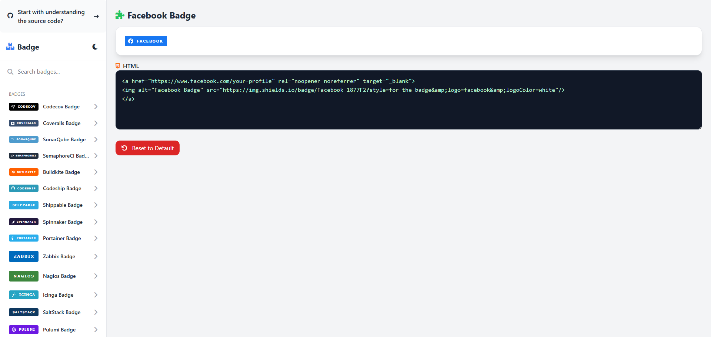
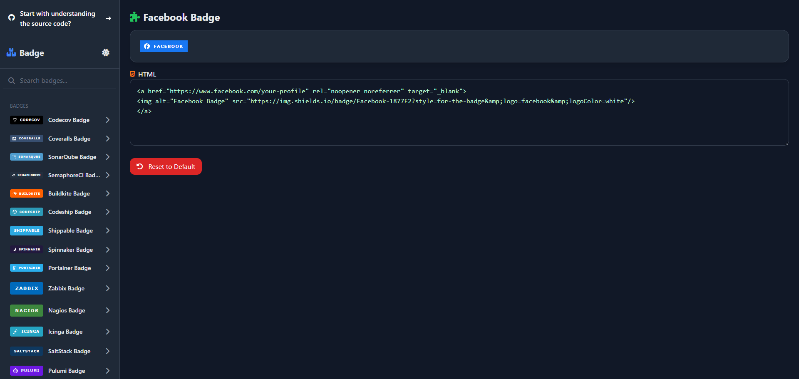

# dangkh0a - Gallery

[](./README.md) [](./README_EN.md)

A lightweight web application that lets users **select badges** and **view the HTML, CSS, and JS source code** for easy customization. Built with HTML, Tailwind CSS, Prism.js, and Font Awesome, featuring light/dark modes and basic PWA support.

## Features

- **Sidebar Navigation**: Badge list grouped by category with thumbnails.
- **Live Preview**: Display badges and toggle source code view.
- **In-Browser Editing**: Modify HTML, CSS, and JavaScript directly in the browser.
- **Reset to Default**: Restore original code with a single click.
- **Search**: Real-time filtering of badges by name.
- **Theme Switcher**: Toggle between light and dark modes.
- **PWA Ready**: Includes `manifest.json` for Web Browser capabilities.
- **Rich Sharing**: Open Graph and Twitter Card tags for enhanced link previews.

## Interface

- **Light Mode**
  
- **Dark Mode**
  

## Requirements

- Modern browser: Chrome, Firefox, Safari, or Edge.
- Internet connection to load CDN libraries.

## Installation

1. **Clone the repository**
   ```bash
   git clone https://github.com/yourusername/dangkh0a-gallery.git
   cd dangkh0a-gallery
   ```
2. **Start a local web server** (e.g., using `live-server`, `http-server`, or your preferred tool).
3. **Open in browser**
   Navigate to `http://localhost:<port>/index.html` to use the app.

## Project Structure

```
├── index.html         # Main entry point
├── style.css          # Custom styles
├── components.json    # Badge definitions
├── manifest.json      # PWA manifest
├── logo.png           # App icon and favicon
├── README.md          # Project documentation (Vietnamese)
├── README_en.md       # Project documentation (English)
```

## Usage Guide

1. Select a badge from the **sidebar** to see it in the preview.
2. Click the preview area to open the **code editor**.
3. Edit HTML, CSS, or JavaScript as desired.
4. Click **Reset** to revert to the original code.
5. Use the **Search** input to filter badges by name.
6. Click the **sun/moon** icon to switch themes.

## Contributing

Contributions are welcome:

1. Fork the repository.
2. Create a new branch: `git checkout -b feature/your-feature-name`.
3. Commit your changes: `git commit -m "Add new badge component"`.
4. Push to your branch: `git push origin feature/your-feature-name`.
5. Open a Pull Request.

## License

This project is licensed under the MIT License. See the `LICENSE` file for details.

> **Note:** Most badge assets (thumbnails, SVGs) are generated via [img.shields.io](https://img.shields.io). This app provides a platform for customization.
